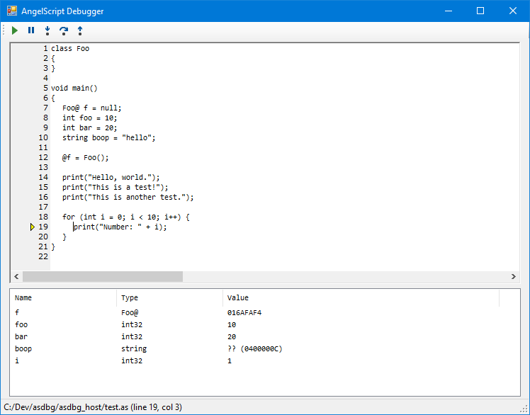

# asdbg

A remote debugger for AngelScript. Currently in very early stages of development.

## Goals

- [ ] Single-header implementation in host application
  - [x] Everything in 1 header
  - [ ] EzSock embedded
- [ ] Stepping through code with a visual code view
  - [x] Step into
  - [ ] Step over
  - [ ] Step out
- [x] Breakpoints
- [x] View local variables
- [ ] View stack trace and inspect each frame individually

## License

MIT license:

Copyright (c) github.com/codecat 2017
